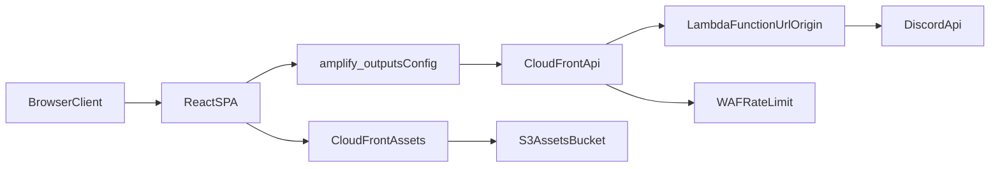

# HSTC – Helvetic Security & Transport Corporation

Vite + React website for HSTC with an Amplify Gen 2 backend function for Discord community data.

## Tech Stack

- Frontend: React 18, TypeScript, Vite, CSS Modules, Anime.js
- Backend: Amplify Gen 2 (`amplify/backend.ts`) with one Lambda function (`discord-aggregate`)
- Edge/Security: CloudFront + AWS WAF (rate limiting) in front of Lambda Function URL
- Tooling: ESLint, Prettier, Vitest, Lighthouse CI

## Real Backend Scope

This repository currently ships **one** backend capability:

- `amplify/functions/discord-aggregate/handler.ts`
  - aggregates Discord scheduled events and image channel data
  - exposed via CloudFront (origin is Lambda Function URL)
  - endpoint published into `amplify_outputs.json` as `custom.discordCombinedUrl`

There is no Cognito/AppSync/Data/Storage resource definition in this repo.

## Prerequisites

- Node.js 22+ recommended
- npm
- AWS access (for sandbox/deploy only)

## Architecture Diagram



## How To Run Locally

Install dependencies:

```bash
npm install
```

Run frontend only:

```bash
npm run dev
```

Run frontend + local Discord aggregate proxy:

```bash
npm run dev:full
```

Run quality checks:

```bash
npm run lint
npm run lint:infra
npm run build
npm run perf:lighthouse
```

## Backend / Amplify

Start sandbox:

```bash
npm run sandbox
```

Remove sandbox:

```bash
npm run sandbox:remove
```

Use `.env.example` as reference for local/deploy variables.

Required Amplify secrets for the aggregate function:

- `DISCORD_BOT_TOKEN`
- `DISCORD_CHANNEL_ID`
- `DISCORD_GUILD_ID`

## Scripts

- `npm run dev` – Vite dev server
- `npm run dev:function` – local Node server for `/api/discord-combined`
- `npm run dev:full` – frontend + local function together
- `npm run build` – typecheck + production build
- `npm run lint` – ESLint for source files
- `npm run lint:infra` – ESLint for `scripts`, `amplify`, `vite.config.ts`
- `npm run perf:lighthouse` – Lighthouse assertions from `.lighthouserc.json`
- `npm run apply:redirects` – apply `amplify-redirects.json` via AWS CLI
- `npm run test:function` – invoke local aggregate function test
- `npm run sandbox` – start Amplify Gen 2 sandbox
- `npm run assets:sync` – sync `public/images` to S3 and optionally invalidate CloudFront

## How Deployment Works

1. Amplify pipeline executes `npx ampx pipeline-deploy` (backend).
2. Backend synthesizes:
   - Discord aggregate Lambda
   - Function URL
   - CloudFront distribution in front of Function URL
   - WAF WebACL with rate-based rule
3. Backend output writes `custom.discordCombinedUrl` to `amplify_outputs.json`.
4. Frontend build runs (`npm run build`), and `vite.config.ts` copies `amplify_outputs.json` into `dist/`.
5. Post-build redirects are synced from `amplify-redirects.json`.

Asset delivery flow:

- Local fallback: `/images/*` from repo
- CDN mode: set `VITE_ASSET_CDN_BASE_URL=https://<asset-cloudfront-domain>`
- Sync assets with `npm run assets:sync` (requires AWS CLI credentials)

## Documentation

- [Architecture](./docs/architecture.md)
- [Deployment](./docs/deployment.md)
- [Amplify Integration](./docs/amplify-gen2-integration.md)
- [AWS CLI + Sandbox (DE)](./docs/aws-cli-und-sandbox-setup.md)
- [Discord Function Setup](./docs/discord-images-function-setup.md)
- [Strict Review Findings](./docs/strict-code-review-full.md)

## License

Private – all rights reserved.
