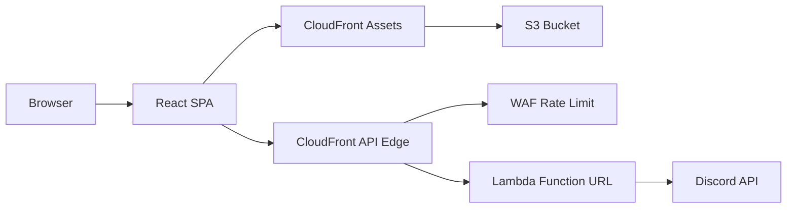

# HSTC — Helvetic Security & Transport Corporation

[](https://github.com/N0ahTM/HSTC/actions/workflows/ci.yml)
[](https://www.typescriptlang.org/)
[](https://react.dev/)
[](https://vitejs.dev/)
[](https://docs.amplify.aws/)
[](https://github.com/GoogleChrome/lighthouse-ci)
[](https://eslint.org/)
[](https://prettier.io/)
[](https://nodejs.org/)

> A production-grade React single-page application built as a private architecture showcase. Emphasis on clean code, strict TypeScript, layered frontend architecture, edge-hardened serverless backends, and performance-first delivery.

---

## Architecture at a Glance



- **Frontend**: Static SPA served via CloudFront + S3 (Amplify Hosting)
- **API Edge**: CloudFront distribution with AWS WAF rate-based rules in front of a Lambda Function URL
- **Backend**: Single-purpose Lambda (`discord-aggregate`) — aggregates Discord guild events and image channel data with short-lived in-memory caching
- **Asset Pipeline**: Images synced to S3 and served through a dedicated CloudFront distribution

---

## Tech Stack

| Layer | Technology | Purpose |
|---|---|---|
| **Framework** | React 18 + TypeScript 5.9 | UI layer with strict typing |
| **Build Tool** | Vite 5 | Fast dev + optimized production builds with Brotli/Gzip |
| **Styling** | CSS Modules + Design Tokens | Scoped styles, no runtime CSS-in-JS overhead |
| **Animations** | Anime.js + Custom Motion Layer | Timeline-driven animations with `prefers-reduced-motion` support |
| **Backend** | AWS Amplify Gen 2 (CDK) | Infrastructure-as-code for Lambda + CloudFront + WAF |
| **Hosting** | Amplify Hosting | CI/CD with branch-based previews |
| **Edge** | CloudFront + AWS WAF | Caching, rate limiting, security headers |
| **Assets** | S3 + CloudFront | Immutable image caching with cache-busting |
| **Quality** | ESLint + Prettier + Vitest + Lighthouse CI | Lint, format, test, and performance budgets in CI |

---

## Project Structure

```
src/
├── lib/
│   ├── ui/          # Domain-agnostic UI primitives
│   ├── utils/       # Shared utilities
│   └── motion/      # Animation engine wrappers & timelines
├── features/
│   └── site/        # HSTC-specific page composition entries
├── sections/        # Concrete section implementations
├── components/      # Reusable presentational components
├── hooks/           # Custom React hooks (motion, data, a11y)
├── providers/       # Context providers (Discord data)
├── config/          # Runtime configuration & endpoint resolution
└── styles/          # Global styles & CSS custom properties

amplify/
├── backend.ts                    # CDK infrastructure definition
└── functions/
    └── discord-aggregate/
        ├── resource.ts           # Function configuration
        └── handler.ts            # Runtime handler
```

### Layer Rules

- `lib/*` — Domain-agnostic code reusable across projects.
- `features/*` — HSTC-specific composition logic.
- `sections/*` — Concrete page sections; no business logic, only layout & data binding.

---

## Key Architectural Decisions

### 1. Strict TypeScript & Dual Type-Check
- `tsconfig.json` for source + `tsconfig.node.json` for build tooling.
- Build script runs both type-checks before Vite compilation: zero runtime surprises from type drift.

### 2. CSS Modules + Design Tokens
- No runtime CSS-in-JS library — styles are scoped at build time via CSS Modules.
- Global tokens (`src/styles/tokens.css`) enforce consistent spacing, color, and typography.

### 3. Motion System with Accessibility First
- All animations respect `prefers-reduced-motion` at the system level.
- `useAnimateOnIntersect` couples Intersection Observer with Anime.js timelines.
- `useAnimatedNumber` handles numeric transitions with cleanup to prevent memory leaks.

### 4. Edge-Hardened Serverless API
- Lambda Function URL is not exposed directly; CloudFront acts as the public entrypoint.
- AWS WAF applies rate-based rules to prevent abuse.
- Optional origin guard (`x-hstc-edge-key`) rejects direct origin requests.
- CORS is restricted to production origins — no wildcard allowances.

### 5. Immutable Asset Caching
- Images served from S3 via CloudFront with `immutable` cache headers.
- `/_manifest.json` explicitly set to `no-cache` to prevent stale metadata.
- Build-time compression (Brotli + Gzip) for all static assets.

### 6. Environment & Endpoint Resolution Strategy
- `amplify_outputs.json` generated by backend deploy, validated in CI before frontend build.
- Frontend resolves endpoints in a strict fallback chain: env override → local proxy → build-time outputs → runtime outputs → fallback URL.
- No hardcoded production URLs in source code.

---

## Performance & Security Highlights

| Area | Implementation |
|---|---|
| **Compression** | Brotli + Gzip via Vite plugin at build time |
| **Caching** | Immutable assets (`/images/*`), strict `Cache-Control` headers via `customHttp.yml` |
| **Security Headers** | HSTS, X-Frame-Options, X-Content-Type-Options, Referrer-Policy |
| **Rate Limiting** | AWS WAF rate-based rule on API edge |
| **Lazy Loading** | Sections render on Intersection Observer; unused code never executes |
| **Reduced Motion** | All animations skip to end-state when `prefers-reduced-motion` is active |
| **Lighthouse CI** | Automated performance, accessibility, best-practices, and SEO audits in CI |

---

## Quality Gates

Every pull request and push to `main` runs:

```bash
npm run lint         # ESLint for src/
npm run lint:infra   # ESLint for scripts, amplify, and config
npm run build        # Type-check + Vite production build
npm run perf:lighthouse  # Lighthouse budget assertions
```

Pipeline defined in [`.github/workflows/ci.yml`](./.github/workflows/ci.yml).

---

## Scripts

```bash
npm run dev           # Vite dev server
npm run dev:full      # Frontend + local Lambda proxy
npm run build         # Full type-check + production build
npm run lint          # Lint source files
npm run lint:infra    # Lint infrastructure and tooling
npm run perf:lighthouse   # Run Lighthouse CI budget checks
npm run sandbox       # Start Amplify Gen 2 sandbox
npm run assets:sync   # Sync public/images to S3 + optional CloudFront invalidation
```

---

## Documentation

- [Architecture](./docs/architecture.md) — System topology, frontend & backend structure, data flow
- [Deployment](./docs/deployment.md) — CI/CD pipeline, edge hardening, asset delivery
- [Animation System](./docs/animations.md) — Motion architecture, scroll reveals, accessibility

