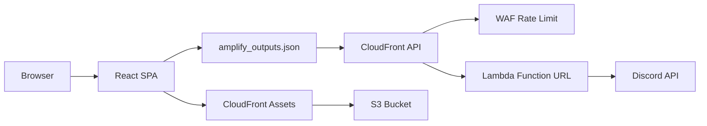

# Architecture

## Overview

HSTC is a statically-hosted React single-page application with a minimal, purpose-built serverless backend. The architecture prioritizes **performance at the edge**, **strict type safety**, and **clear separation of concerns** across the frontend layer stack.

## Runtime Topology



1. Browser loads the SPA from Amplify Hosting (CloudFront + S3).
2. Frontend resolves the Discord aggregate API endpoint from `amplify_outputs.json`.
3. API requests hit a CloudFront distribution acting as the public edge.
4. AWS WAF rate-based rules filter abusive traffic before it reaches origin.
5. A Lambda Function URL serves as the origin, querying Discord APIs with short-lived in-memory caching.
6. Static assets (images) are served from a separate S3-backed CloudFront distribution with immutable caching.

---

## Frontend Architecture

### Layer Stack

| Layer | Path | Responsibility |
|---|---|---|
| **Primitives** | `src/lib/ui` | Domain-agnostic UI building blocks |
| **Utilities** | `src/lib/utils` | Pure helpers, formatters, guards |
| **Motion** | `src/lib/motion` | Animation engine abstraction (Anime.js wrappers) |
| **Features** | `src/features/site` | HSTC-specific page composition logic |
| **Sections** | `src/sections` | Concrete section implementations (layout + data binding) |
| **Components** | `src/components` | Shared presentational components |
| **Hooks** | `src/hooks` | Reusable React hooks (data, motion, a11y) |
| **Providers** | `src/providers` | Context providers for shared state |

### Layer Rules

- Code in `src/lib/*` must be **domain-agnostic** — reusable in another project without modification.
- Code in `src/features/*` describes **page composition** specific to HSTC.
- `src/sections/*` contains only layout and data binding; business logic lives in hooks and providers.

### Key Frontend Patterns

**Lazy Section Rendering**
- Sections below the fold use `IntersectionObserver` via `useAnimateOnIntersect`.
- Sections render only when entering the viewport, reducing initial bundle execution.
- Fallback render logic ensures content appears even if `IntersectionObserver` is unavailable.

**Data Flow**
- `DiscordDataProvider` centralizes Discord data fetching (events, images, stats).
- Request-generation gates prevent race conditions between concurrent fetches.
- Defensive response normalization guards against malformed API payloads.

**Endpoint Resolution Chain**
`src/config/amplifyOutputs.ts` resolves the aggregate API endpoint in strict priority:
1. `VITE_DISCORD_COMBINED_ENDPOINT` (explicit override)
2. Local dev proxy (`/api/discord-combined`) when `VITE_USE_LOCAL_DISCORD_API=true`
3. Build-time `amplify_outputs.json`
4. Runtime `/amplify_outputs.json` (fetched from host)
5. `VITE_DISCORD_COMBINED_FALLBACK`

---

## Backend Architecture

### Scope

The backend is intentionally minimal: one Lambda function that aggregates Discord data.

```
amplify/
├── backend.ts
└── functions/
    └── discord-aggregate/
        ├── resource.ts
        └── handler.ts
```

No Cognito, AppSync, DynamoDB, or Storage resources are defined. This keeps the infrastructure surface small and the cold-start latency low.

### `discord-aggregate` Function

- **Input**: Query params (`mode=events|images|both`, `limit`, `all`)
- **Logic**: Fetches Discord scheduled events and image channel data; applies 60-second in-memory cache
- **Output**: Normalized JSON with `events`, `images`, and `meta` (cache status, fetch timestamp)
- **Security**: Optional `x-hstc-edge-key` header validation; debug details gated by `ALLOW_PUBLIC_DEBUG_DETAILS`

### Infrastructure (CDK via Amplify Gen 2)

- **Lambda**: Node.js 22 runtime, ARM64 architecture for cost/performance
- **Function URL**: IAM-authenticated origin; public access blocked by CloudFront origin guard
- **CloudFront Distribution**: Public API entrypoint with custom cache behaviors
- **WAF WebACL**: Rate-based rule (IP-level) to prevent abuse

---

## Configuration & Environment

### Frontend Environment Variables

| Variable | Purpose |
|---|---|
| `VITE_DISCORD_WIDGET_URL` | Discord widget endpoint for live stats |
| `VITE_DISCORD_COMBINED_ENDPOINT` | Explicit aggregate API override |
| `VITE_DISCORD_COMBINED_FALLBACK` | Fallback endpoint if outputs are missing |
| `VITE_USE_LOCAL_DISCORD_API` | Enable local `/api/discord-combined` proxy in dev |
| `VITE_ASSET_CDN_BASE_URL` | Optional CloudFront base URL for image delivery |

### Backend Secrets

- `DISCORD_BOT_TOKEN`
- `DISCORD_CHANNEL_ID`
- `DISCORD_GUILD_ID`
- `DISCORD_EDGE_ORIGIN_KEY` (optional origin guard)

Secrets are injected via Amplify Secrets Manager — never committed or inlined into function config.

---

## Security Model

| Layer | Control |
|---|---|
| **Edge** | CloudFront + WAF rate limiting |
| **Origin** | Lambda Function URL with optional header guard |
| **CORS** | Restricted to production origins (no wildcard) |
| **Headers** | HSTS, X-Frame-Options, X-Content-Type-Options, Referrer-Policy |
| **Secrets** | Amplify Secrets Manager; no plaintext env inlining |
| **Debug** | Internal error details suppressed unless explicitly enabled |
