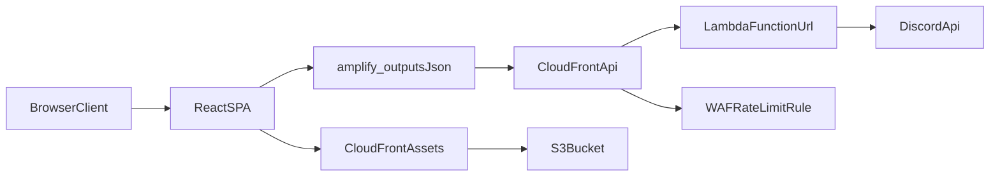

# HSTC Architecture (Current Implementation)

## Overview

HSTC is a Vite/React single-page application deployed on Amplify Hosting.
Backend scope is intentionally small: one Amplify Gen 2 Lambda function for Discord data aggregation.

## Runtime Topology

1. Browser loads static assets from Amplify/CloudFront.
2. Frontend sections fetch Discord data through:
   - Discord widget endpoint (`VITE_DISCORD_WIDGET_URL` or default)
   - aggregate endpoint from `amplify_outputs.json` (`custom.discordCombinedUrl`, now CloudFront edge URL)
3. CloudFront forwards API requests to Lambda Function URL.
4. WAF (rate-based) protects the CloudFront API edge.
5. Aggregate function queries Discord APIs, applies short-lived in-memory cache, and returns normalized events/images.



## Backend Structure

```
amplify/
├── backend.ts
└── functions/
    └── discord-aggregate/
        ├── resource.ts
        └── handler.ts
```

No Cognito/AppSync/Data/Storage resources are defined in this repository.

## Frontend Structure

- App shell and lazy loading: `src/App.tsx`
- Reusable layer: `src/lib/ui`, `src/lib/utils`, `src/lib/motion`
- Site-specific feature wrappers: `src/features/site/*`
- Data context: `src/providers/DiscordDataProvider.tsx`
- Endpoint resolution: `src/config/amplifyOutputs.ts`
- Community events/images UI: `src/sections/CommunitySection.tsx`, `src/sections/CommunityImagesSection.tsx`
- Hero/join live counters: `src/hooks/useDiscordStats.ts`

### Reuse Boundary Rules

- Put code in `src/lib/*` if it is domain-agnostic and reusable in another site.
- Put code in `src/features/*` if it describes HSTC-specific page composition.
- Keep `src/sections/*` as concrete implementations while `src/features/site/*` acts as composition entrypoints.

## Configuration and Environment

### Generated output

- `amplify_outputs.json` is generated by Amplify backend deploy.
- `vite.config.ts` copies it into `dist/` for runtime access.

### Frontend env vars

| Variable | Purpose |
| --- | --- |
| `VITE_DISCORD_WIDGET_URL` | Discord widget endpoint |
| `VITE_DISCORD_COMBINED_ENDPOINT` | Explicit aggregate endpoint override |
| `VITE_DISCORD_COMBINED_FALLBACK` | Fallback endpoint if outputs are missing |
| `VITE_USE_LOCAL_DISCORD_API` | Use local `/api/discord-combined` proxy in dev |
| `VITE_ASSET_CDN_BASE_URL` | Optional CloudFront base URL for `/images/*` delivery |

### Backend secrets

- `DISCORD_BOT_TOKEN`
- `DISCORD_CHANNEL_ID`
- `DISCORD_GUILD_ID`
- `DISCORD_EDGE_ORIGIN_KEY` (optional header guard from CloudFront to Lambda)

## Deploy Flow

Defined in `amplify.yml`:

1. `ampx pipeline-deploy` deploys backend (Lambda + Function URL + CloudFront API edge + WAF rule).
2. `amplify_outputs.json` is validated.
3. Frontend build runs (`npm run build`).
4. Redirect sync script applies custom rules to Amplify app.
5. Optional asset pipeline syncs `public/images` to S3 and serves via CloudFront asset domain.
6. Frontend image utilities require an asset base URL from `custom.assetBaseUrl` (no local fallback).

## Operational Notes

- Redirect rules source of truth: `amplify-redirects.json`
- Security/cache headers source of truth: `customHttp.yml`
- Strict findings and remediation tracking: `docs/strict-code-review-full.md`
