# Deployment

## CI/CD Pipeline

The project uses **AWS Amplify Hosting** with a full-stack CI/CD pipeline defined in `amplify.yml`.

```mermaid
flowchart LR
  push[Git Push] --> ci[GitHub Actions CI]
  ci --> amplify[Amplify Hosting]
  amplify --> backend[Backend Build]
  backend --> outputs[amplify_outputs.json]
  outputs --> validate[Validate Outputs]
  validate --> frontend[Frontend Build]
  frontend --> redirects[Apply Redirects]
  redirects --> deploy[Deploy to CloudFront]
```



### GitHub Actions CI

Triggered on every push to `main` and every pull request:

```bash
npm run lint         # Source lint
npm run lint:infra   # Infrastructure lint
npm run build        # Type-check + Vite build
npm run perf:lighthouse  # Performance budget checks
```

### Amplify Hosting Pipeline

**Backend Phase**
```bash
npm ci --cache .npm --prefer-offline
npx ampx pipeline-deploy --branch $AWS_BRANCH --app-id $AWS_APP_ID
```

- Deploys Lambda, Function URL, CloudFront distribution, and WAF WebACL
- Generates `amplify_outputs.json` with `custom.discordCombinedUrl` and `custom.assetBaseUrl`

**Frontend Phase**
```bash
# Pre-build
npm ci --cache .npm --prefer-offline

# Build
node -e "validate amplify_outputs.json exists and is valid JSON"
npm run build

# Post-build
node scripts/apply-amplify-redirects.mjs
```

- Validates `amplify_outputs.json` before building to fail fast on backend issues
- Applies custom redirect rules from `amplify-redirects.json`

---

## Infrastructure as Code

All infrastructure is defined in TypeScript via **Amplify Gen 2 (CDK)**:

- `amplify/backend.ts` — CloudFront distribution, WAF WebACL, Lambda function wiring
- `amplify/functions/discord-aggregate/resource.ts` — Function configuration (memory, timeout, architecture)
- `amplify/functions/discord-aggregate/handler.ts` — Runtime logic

No manual console configuration is required for standard deployments.

---

## Edge Hardening

### CloudFront Distribution

- Serves as the **only** public entrypoint to the API
- Custom behaviors for API vs. asset paths
- Origin guard via custom header (`x-hstc-edge-key`) optional

### AWS WAF

- Rate-based rule: blocks IPs exceeding request thresholds
- Applied at the CloudFront edge, before Lambda invocation

### Security Headers

Defined in `customHttp.yml` and `public/_headers`:

| Header | Value | Purpose |
|---|---|---|
| `Strict-Transport-Security` | `max-age=63072000; includeSubDomains` | Enforce HTTPS |
| `X-Frame-Options` | `DENY` | Prevent clickjacking |
| `X-Content-Type-Options` | `nosniff` | Prevent MIME sniffing |
| `Referrer-Policy` | `strict-origin-when-cross-origin` | Control referrer leakage |

---

## Asset Delivery

Images are served through a dedicated CloudFront distribution backed by S3:

1. **Sync**: `npm run assets:sync` uploads `public/images` to S3
2. **Cache**: `/images/*` served with `immutable` cache headers
3. **Manifest**: `/_manifest.json` explicitly set to `no-cache` for fresh metadata
4. **Override**: `VITE_ASSET_CDN_BASE_URL` can override the CloudFront domain at build/runtime

---

## Redirect Management

Redirects are the single source of truth in `amplify-redirects.json`:

- Applied automatically in the post-build phase
- JSON schema validation + idempotence check before writing
- Branch-gated: only the production branch mutates app-wide redirect rules
- Fail-soft: deployment continues if redirect application fails unexpectedly
